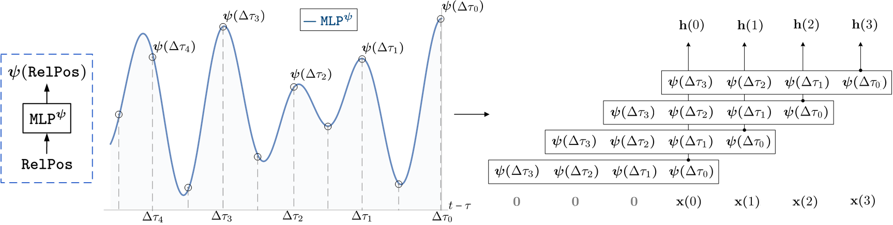

## CKConv: Continuous Kernel Convolution For Sequential Data

This repository contains the source code accompanying the paper:

 [CKConv: Continuous Kernel Convolution For Sequential Data](https://arxiv.org/abs/2102.02611)  [[Slides]](https://app.slidebean.com/p/wgp8j0zl62/CKConv-Continuous-Kernel-Convolutions-For-Sequential-Data) [[Demos]](https://github.com/dwromero/ckconv/tree/master/demo) <br/>**[David W. Romero](https://www.davidromero.ml/), [Anna Kuzina](https://akuzina.github.io/), [Erik J. Bekkers](https://erikbekkers.bitbucket.io/), [Jakub M. Tomczak](https://jmtomczak.github.io/) & [Mark Hoogendoorn](https://www.cs.vu.nl/~mhoogen/)**.

[](https://paperswithcode.com/sota/sequential-image-classification-on-sequential?p=ckconv-continuous-kernel-convolution-for)
[](https://paperswithcode.com/sota/sequential-image-classification-on-sequential-1?p=ckconv-continuous-kernel-convolution-for)

#### Abstract
*Conventional neural architectures for sequential data present important limitations. Recurrent networks suffer from exploding
and vanishing gradients, small effective memory horizons, and must be trained sequentially. Convolutional networks are unable to handle sequences of unknown size
and their memory horizon must be defined a priori. In this work, we show that all these problems can be solved by formulating convolutional kernels
in CNNs as continuous functions. The resulting Continuous Kernel Convolution (CKConv) allows us to model arbitrarily long sequences
in a parallel manner, within a single operation, and without relying on any form of recurrence. We show that Continuous Kernel Convolutional Networks
(CKCNNs) obtain state of the art results in multiple datasets, e.g., permuted MNIST, and, thanks to their continuous nature, are able to handle
non-uniformly sampled datasets and irregularly sampled data natively. CKCNNs at least match neural ODEs designed for these purposes in a
much faster and simple manner.*



### Repository structure

#### Folders

This repository is organized as follows:

* `ckconv` contains the main PyTorch library of our model.

* `datasets` implements `Dataset` wrappers for the datasets used.

* `ckernel_fitting` contains source code to run experiments to approximate convolutional filters via MLPs. Please see `ckernel_fitting/README.md` for further details. 

* `demo` provides some minimalistic examples on the usage of CKConvs and the construction of CKCNNs. 

* `models` contains the models used throughout our experiments.

* `probspec_routines` contains routines specific to some of the problems considered in this paper.
  
* `runs` contains the command lines used to obtain the results reported in our experiments. 

* `saved` contains various pretrained models. 

### Reproduce

#### Install

###### conda *(recommended)*
In order to reproduce our results, please first install the required dependencies. This can be done by:
```
conda env create -f conda_requirements.txt
```
This will create the conda environment `ckconv` with the correct dependencies.

###### pip
The same conda environment can be created with `pip` by running:
```
conda create -n ckconv python=3.7
conda activate ckconv
conda install pytorch==1.7.0 torchvision==0.8.1 torchaudio=0.7.0 cudatoolkit=10.1 -c pytorch
pip install -r requirements.txt
```

###### manual installation
If you prefer to construct the conda environment manually, please follow the commands speficiend in `manual_installation.txt`

#### Experiments and `config` files
To reproduce the experiments in the paper, please follow the configurations given in `runs/README.md`

Specifications on the parameters specified via the `argsparser` can be found in the corresponding `config.py` file.

#### Pretrained models
To use pretrained models, please add the argument `--config.pretrained=True` to the corresponding execution line.

#### Recommendations and details

###### Replacing fft convolutions with spatial convolutions
We leverage the convolution theorem in our experiments to accelerate the computation of the convolution operations (see 
`causal_fftconv` in `ckconv/nn/functional/causalconv.py`), and we strongly recommend using fft convolutions.
However, for some applications it might be desirable to rely on spatial convolutions, e.g., small conv. kernels. This can be easily modified by replacing
the call to `causal_fftconv` in the forward pass of the `CKConv` class (`ckconv/nn/ckconv.py:182`)  by the function `causal_conv` found in `ckconv/nn/functional/causalconv.py`. 

### Cite
If you found this work useful in your research, please consider citing:
```
@article{romero2021ckconv,
  title={CKConv: Continuous Kernel Convolutions for Sequential Data},
  author={Romero, David W and Kuzinna, Anna and Bekkers, Erik J and Tomczak, Jakub M and Hoogendoorn, Mark},
  journal={arXiv preprint arXiv:2102.02611},
  year={2021}
}
```

### Acknowledgements
*We gratefully acknowledge Gabriel Dernbach for interesting analyses on the knot distribution of ReLU networks. We thank Emiel van Krieken and Ali el Hasouni as well for interesting questions and motivating comments at the beginning of this project.
David W. Romero is financed as part of the Efficient Deep Learning (EDL) programme (grant number P16-25), partly
funded by the Dutch Research Council (NWO) and Semiotic Labs. Anna Kuzina is funded by the Hybrid Intelligence Center, a 10-year programme funded
by the Dutch Ministry of Education, Culture and Science through the Netherlands Organisation for
Scientific Research. Erik J. Bekkers is financed by the
research programme VENI (grant number 17290) funded by the Dutch Research Council. All authors are thankful to everyone
involved in funding this work.
This work was carried out on the Dutch national e-infrastructure with
the support of SURF Cooperative.*